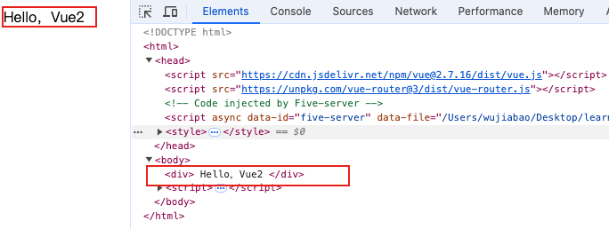
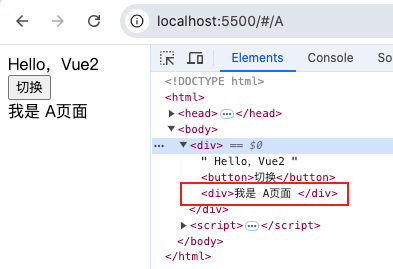
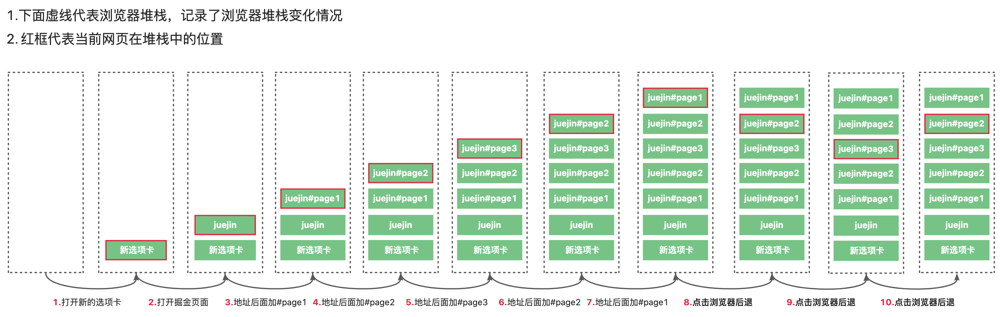

> VueRouter究竟做了什么？

最近遇到一个需求：在 A 页面发起一个请求（这个接口请求比较耗时），然后切换到 B页面时获得之前跳转的页面地址。

然后发现 router 只能获取当前的那个页面地址，也就是 B 页面。

无法获取 A 页面的地址。

```html
<!DOCTYPE html>
<html>
    <head>
        <script src="https://cdn.jsdelivr.net/npm/vue@2.7.16/dist/vue.js"></script> 
    </head>
    <body>
        <div id="root"></div>
        <script> 
            new Vue({
                template:`
                    <div>
                        Hello，Vue2
                    </div>
                `
            }).$mount('#root')
        </script>
    </body>
</html>
```



如上图所示，界面上成功打印出了```Hello，Vue2```字样。

我们加上Vue-Router试一下路由功能。

```html
<html>
<head>
    <!-- 引用 Vue-Router CDN-->
    <script src="https://unpkg.com/vue-router@3/dist/vue-router.js"></script>
</head>
<body>
    <script>
            Vue.use(VueRouter);
            const routes = [
                { path:'/A', component:{ template:`<div>我是 A页面 </div>` } },
                { path:'/B', component:{ template:`<div>我是 B页面 </div>` } }
            ];
            const router = new VueRouter({  routes });
            new Vue({
                router, 
                template:`
                    <div>
                        Hello，Vue2
                        <button 
                            @click="$router.push($route.fullPath === '/A'?'/B':'/A')"
                        >切换</button>
                        <router-view />
                    </div>
                `
            }).$mount('#root')
        </script>
</body>
</html>
```



通过上述代码：我们可以实现 A 页面到 B页面的切换。

# 一、为什么前端框架需要 “前端路由“ 

众所周知，在传统的多页应用中，每一个页面都是一个独立的 HTML 文件。

点击链接或者导航时，需要重新加载整个页面，包括页面的布局、样式和脚本。

而现在的 Vue、React 等框架项目大部分都是单页应用。

而在单页应用中，初始页面的加载只发生一次。

既然只加载一次，那么后续如何实现在浏览器中输入不同的路径就可以出现不同的内容呢？

这里就需要前端路由进行参与。 

现代浏览器提供一些 API, 如 ```hashchange、popstate```可以用来监听路由的变化。

通过 Javascript 等技术可以实现在用户与应用交互时，只更新页面的部分内容。 

```“前端路由”可以根据URL来选择执行特定的代码逻辑。```

单页应用是前端开发的一个革新。 

前端路由存在以下几点优势：

1. 改变 URL，但是界面无需重新加载。可以不用刷新浏览器就可以改变网页内容，用户体验大大提高。
2. 前端渲染把渲染的任务交给了浏览器，通过客户端来解决页面的构建，这个很大程度上缓解了服务端的压力。


# 二、前端路由的基本原理

前面我们说到，所谓前端路由就是通过监听路由的变化来更改页面的部分内容。

那么前端路由是```如何做到更改路由而不触发浏览器的重新加载```？

又是如何做到```监听路由的变化并做出反应```？

## 2.1 hash（哈希）模式和history模式

一般前端路由实现分为两种：```hash 和 history```。

他们都可以做到更改路由但是不会引起页面刷新。

可以说前端路由框架如 ```vue-router```、```react-router``` 就是基于这两个 API进行封装的。

区分 hash 和 history 路由的方式就是看地址栏 URL 上是否带有#，#代表是 hash 模式，没有的话就是 history 模式。

hash 路由模式通过监听 url 中 hash 变化渲染不同的内容，它不会向服务器发送请求。

history 路由模式是监听 url 路径变化，需要客户端和服务端支持。

## 2.2 hash路由实现原理

### 2.2.1 URL的哈希部分 & 监听hashchange事件

在URL中，```​hash​是 ​# ​​​及后面的那部分```。

例如，在http://example.com/#/home中，#/home就是哈希部分。

```改变 URL 中的 hash部分不会引起页面刷新```。

```hash​​​的改变会通过触发​​hashchange​​​事件监听​​URL​​​的变化```，可以用来执行相对于的操作来渲染页面。

通过浏览器前进后退改变​​URL​​​、通过标签改变​​URL​​​、通过​​window.location​​​改变​​URL​​​，这几种情况改变​​URL​​​都会触发​​hashchange​​事件。

### 2.2.2 更新哈希值 & 解析哈希值

更新 hash 值可以通过修改 location.hash。 

```js
// 更新路由
window.location.hash = "/one";
// 跟上面这种写法一致
window.location.hash = "#/one";

// 路由会发生下面的变化 自动添加 # 号
// https://juejin.cn/post/7380261903640051727 -> https://juejin.cn/post/7380261903640051727#/one
```

在 hashchange 事件的回调中，你可以读取最新的 hash 值并解析它，根据解析结果显示相应的组件或者执行相应的逻辑。

```js
// 处理hash变化的函数
window.addEventListener("hashchange",function(e){
    // 去掉第一个字符(#)
    const hash = location.hash.slice(1);
    // ...
})
```

### 2.2.3 浏览器历史栈变化 

#### 2.2.3.1 history.length 

使用 history.length 可以获取```当前浏览器会话中的历史栈长度```。 

这个数值表示了从用户打开浏览器会话(session)并导航到当前页面以来所访问过的网页数量。

这表示刷新浏览器不会清除这个历史栈，因为它并没有销毁会话。

浏览器的历史记录是基于标签页（tab）和窗口（window）来维护的，所以如果你在一个标签页中打开了多个窗口，每个窗口都有自己的历史记录。

此外，window.history.length 不会考虑到用户在同一域名下的不同标签页之间的导航，它只关注单个标签页的历史记录。

如果你关闭了一个标签页然后重新打开一个新的，那么新的标签页将开始一个新的会话，之前关闭的标签页的历史记录不会被继承。

#### 2.2.3.2  hash 改变导致的变化

如果一个网页只是锚点（也就是 location.hash）发生变化，也会导致历史记录栈发生变化，并会在浏览器会话历史栈上添加一个信息。

#### 2.2.3.3 改变浏览器锚点的方式

1. 直接更改浏览器地址，在最后面增加或改变#hash。
2. 通过改变 location.href 或 location.hash 的值。
3. 通过触发点击带锚点的链接。
4. 浏览器前进后退。

#### 2.2.3.4 测试浏览器堆栈变化

以下面这个步骤操作：

1. 打开一个新的 tab 页 
2. 打开 掘金 页面
3. 在地址栏后面输入#page1
4. 在地址栏后面输入#page2
5. 在地址栏后面输入#page3
6. 在地址栏后面输入#page2
7. 在地址栏后面输入#page1
8. 点击浏览器后退按钮 发现后退到#page2
9. 点击浏览器后退按钮 发现后退到#page3
10. 点击浏览器前进按钮 发现前进到#page2

然后我们打开浏览器输入 history 查看历史栈查看长度为 7。

我们画一幅图来简单描述下这个过程。



通过这种图我们可以很清晰的了解到：

1. 点击前进/后退按钮不会改变当前历史栈的大小，只是会改变当前网页的位置。
2. 改变 hash 会在堆栈上push一条页面信息。
3. 新开一个 tab 页也会在堆栈上保存。

## 2.3 history路由实现原理

hash模式的核心是 路由上 hash 变化，不会重新刷新页面。

而 history 模式借助的是 ```window.history API```来实现修改 URL，使用 history 改变 URL 不会引起页面刷新。

### 2.3.1 history API && 监听popstate事件

history 提供的一些方法可以操作当前网页在浏览器的会话历史纪录中的位置。

我们前面说到的 ```history.length``` 就是可以查询会话历史记录的大小。

下面列举一下常用的 history API：
 
1. back() : 后退到浏览器上一次的会话历史
2. forward() : 前进到浏览器下一次的会话历史
3. go(number) : 转到指定某一次浏览器会话历史，正数为前进，负数为后退；
4. pushState（state,title,url）：前进到指定URL，会将URL数据push进会话历史中；
5. replaceState（state,title,url）：将URL替换当前路径；

```js
window.history.pushState({state:"start"},'测试',"/pushStateUrl")
```

popstate类似于一个事件函数。

当用户在浏览器点击后退、前进，或者在js中调用histroy.back()，history.go()，history.forward()等，会触发popstate事件。
 
但pushState、replaceState不会触发这个事件。 

```js
window.addEventListener("popstate",function(e){
    console.log("监听 会话历史记录 变化",e)
})
```

上面的几种 history API 只会修改当前页面的URL，并不会发送请求。

但是如果你刷新浏览器，就会向浏览器发发送 http 网页请求，因此如果使用 history 路由模式，需要服务端配置。

### 2.3.2 为什么 history 路由需要配置
 
history路由（不含哈希部分的 URL，基于 HTML5 History API）和哈希路由之间的主要区别在于 ```URL 结构```和```浏览器行为```。

哈希路由之所以不需要额外的服务器配置，是因为它使用 URL 中的哈希部分（#）来管理路由，而这部分不会被发送到服务器。

相反，哈希路由只在客户端中进行路由切换，服务器只处理应用的入口点（通常是 index.html）的请求。

当用户刷新包含 history 路由的页面时，浏览器将向服务器发送带有特定路由路径的请求。

服务器必须能够映射这些请求到应用的入口点，以便前端路由可以重新渲染正确的视图。

这需要服务器配置来确保这种映射和处理。

```js
// 一般在部署前端应用时 通常会使用 nginx 
server {
    listen 9000;
    server_name localhost;

    location / {
        root html;
        index index.html index.htm;
    }
}
```

## 2.4 hash模式与 history模式的区别

1. hash 模式较丑，history 模式较优雅

* 在使用hash模式时，URL中会包含一个#符号，这通常用来表示页面内的锚点定位。许多人认为这样的URL不够“漂亮。

```js
http://example.com/#/home
``` 

* 相比之下，使用history模式时，URL看起来就像是普通的HTTP请求一样，没有任何特殊标记。这样的URL更加直观，看起来就像一个标准的网页链接。由于没有#符号的存在，很多人会觉得这样的URL更加简洁、专业和优雅。

```js
http://example.com/home
```

2. pushState设置的新URL可以是与当前URL同源的任意URL；而hash只可修改#后面的部分，故只可设置与当前同文档的URL。

3. pushState设置的新URL可以与当前URL一模一样，这样也会把记录添加到栈中；而hash设置的新值必须与原来不一样才会触发记录添加到栈中;

4. pushState通过stateObject可以添加任意类型的数据到记录中；而hash只可添加短字符串;

5. pushState可额外设置title属性供后续使用;

6. hash兼容IE8以上，history兼容IE10以上;

7. history模式需要后端配合将所有访问都指向index.html，否则用户刷新页面，会导致404错误。

# 三、手写 VueRouter 构造函数

在开发一个vue2项目时，我们往往会先实例化一个router对象。

而实例化 router对象的 构造函数就是 ```VueRouter```。

```js
const router = new VueRouter()
```

## 3.1 构造函数属性```mode```

mode属性用于指定路由的工作模式。

这个属性决定了你的应用如何管理和操作浏览器的历史记录，以及如何构建 URL。

```mode的默认属性为 hash。```

```js
// 下面这两种写法一致
const router = new VueRouter();
const router = new VueRouter({ mode:"hash" });
```

所以我们很容易写出下面这段代码：

```js
export default class VueRouter{

    mode;

    // options 空默认值代表空
    constructor(options = {}){
        let mode = options.mode || 'hash';

        this.mode = mode;
    }
}
```

## 3.2 Hash模式下初始化时给路由添加 hash 符号

我们在初始化构造函数的时候会发现 hash 路由 已经生效了。

如你在地址栏上输入：```http://example.com```。

会自动加上```#```。

变成下面这种形式：```http://example.com/#/```

这种现象是因为 Vue Router 默认会为你的应用提供一个默认的```首页路由```。

这是因为 Vue Router 在初始化时会检查当前的 URL 是否包含 # 符号，并根据 # 后面的内容来确定当前的路由位置。

如果没有指定任何路径，默认情况下，它会将 # 加到 URL 的末尾，并指向你定义的默认路由（通常是首页）。

## 3.3 hash 路由是如何在初始化时在路径上增加#的呢？

### 3.3.1 getHash

```js
export function getHash () { 
  let href = window.location.href
  const index = href.indexOf('#')
  if (index < 0) return ''

  href = href.slice(index + 1)

  return href
}
```

上面这段代码首先获取当前页面的完整 URL，然后查找 # 的位置。

如果没有找到 #，说明当前 URL 没有 hash 部分，函数返回空字符串。

如果有 #，则截取从 # 后面开始的字符串作为 hash 部分并返回。

可以很轻松的看出这个函数是为了```获取 URL 中的 hash ```部分。

那么为什么不直接使用 ```location.hash``` 呢？

有下面这几个因素影响：

1. ```解码差异```：不同浏览器对 hash 的处理可能有所不同。例如，在某些浏览器（如 Firefox）中，window.location.hash 返回的字符串已经被解码（即转换成了 Unicode 字符）。而在其他浏览器中，它可能仍然包含编码后的字符（如 %20 代表空格）
2. ```一致性```：为了保证跨浏览器的一致性，手动提取 hash 部分可以确保始终得到原始的、未解码的字符串。这样可以避免在处理 hash 值时出现意外的行为或错误。
3. ```控制力更强```：通过手动从 href 中截取 hash 部分，可以更精确地控制如何处理这部分数据。例如，您可以选择是否要对其进行解码，或者如何处理解码过程中的异常字符。

### 3.3.2 使用 pushState 来更改路由

```js
constructor(){
    // ......
    switch(mode){
        case 'hash':
            // 在路由上增加 hash 的逻辑
            const path = getHash();
            // 如果没有 hash 则添加 hash
            if(path === ''){
                window.history.pushState({ key:'' }, '', '/#/')
            }
            break
        default:
            throw newError("请指定路由模式")
    }
}

```